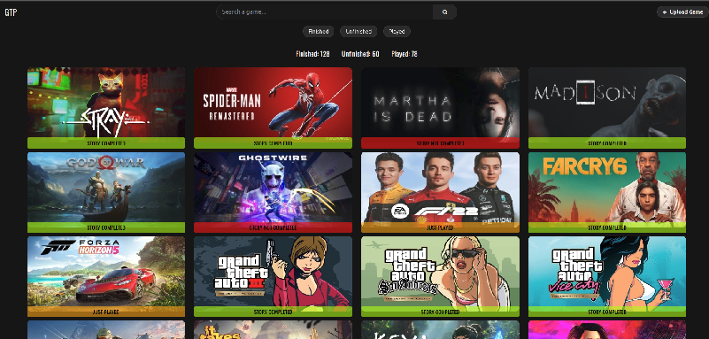
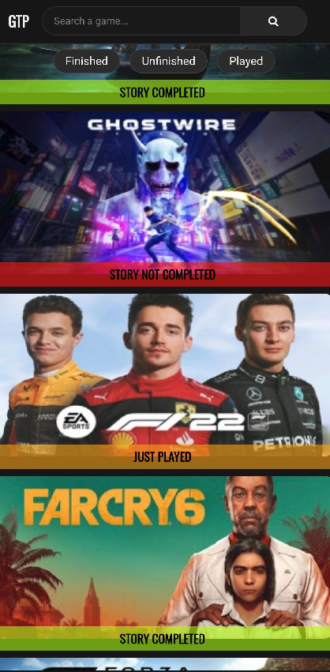

# GamesTP (Game Progress Tracker)

## Description
**GamesTP** is a web application designed to help users catalog and track the progress of their video games. By uploading game titles, avatars, wallpapers, and trailer links, users can see at a glance which games they have finished, which are unfinished, and which they have just played. The site features:
- A modern, YouTube-inspired dark theme with responsive design (desktop and mobile).
- Fuzzy groupings of games by status: “Story Completed,” “Story Not Completed,” and “Just Played.”
- A search bar to quickly locate any game in the collection.
- Filter “chips” to view only Finished, Unfinished, or Played games.
- Secure upload functionality (password-protected) for adding new games to the database.
- Real-time counters that update to show how many games are in each status category.

Built with PHP, MySQL, JavaScript, and a clean CSS/HTML front end, GamesTP is fully self-hostable. It demonstrates how to tie together a relational database with a dynamic interface, complete with modals, toasts, and responsive styling.

---

## Features

1. **Data Storage & Structure**  
   - Implements a MySQL database (via `database.php`) containing a single `games` table, with columns:  
     - `id` (PRIMARY KEY)  
     - `title` (VARCHAR)  
     - `status` (ENUM: ‘STORY COMPLETED’, ‘STORY NOT COMPLETED’, ‘JUST PLAYED’)  
     - `image` (VARCHAR, points to an avatar thumbnail in `/images`)  
     - `trailer` (VARCHAR, external YouTube link)  

2. **Search & Filters**  
   - **Search Bar**: Users can type any part of a game title to see matching results.  
   - **Filter Chips**: Three clickable buttons—Finished, Unfinished, Played—allow users to filter the grid by game status.  
   - **Live Counters**: Above the grid, dynamic counters display how many games currently exist in each category. When a filter is applied, only the counter for that category is shown.

3. **Game Thumbnails Grid**  
   - Each game appears as a 420×200 thumbnail (AVATAR) with a status badge at the bottom.  
   - **Status Badges** use distinctive colors with semi-transparent backgrounds, and are overlaid on the bottom of each thumbnail:  
     - **Story Completed** → semi-transparent neon green  
     - **Story Not Completed** → semi-transparent red  
     - **Just Played** → semi-transparent orange  
   - Badges are bold, black text (no underlines), so they remain legible on top of any image.  
   - **Responsive Layout**: On desktop (≥1025px), images are displayed in a wrapped grid centered horizontally. On mobile/tablet (≤1024px), the grid resizes and images shrink to 150×84.

4. **Upload Game (Password-Protected Modal)**  
   - Clicking the **“+ Upload Game”** button (styled like YouTube’s “+ Create” pill) opens an admin-password modal.  
   - After entering the correct password, a second modal appears allowing the user to:  
     1. **Enter Game Title** (text)  
     2. **Select Status** (dropdown: STORY COMPLETED, STORY NOT COMPLETED, JUST PLAYED)  
     3. **Upload Avatar** (image file, recommended 420×200)  
     4. **Upload Wallpaper** (image file, recommended 1920×1080)  
     5. **Enter Trailer Link** (YouTube URL)  
   - Upon successful upload, the new game is inserted into the database, and the user sees a toast notification in the top-right corner:  
     > **“Game successfully uploaded!”**

5. **Modals & User Feedback**  
   - **Admin Password Modal**: A translucent overlay dims the background; the modal box is centered with a password field and submit button.  
   - **Upload Game Modal**: Similar overlay with fields for title, status, file uploads, and trailer URL.  
   - **Toast Notification**: A green toast appears in the top-right for 5 seconds whenever a new game is added, confirming success.

6. **Dark Theme & Responsive CSS**  
   - Inspired by YouTube’s dark mode:  
     - `#0F0F0F` as background, `#F1F1F1` as standard text color.  
     - Search bar and filter chips styled with subtle gray borders and hover states.  
     - “+ Upload Game” pill uses `rgba(39, 39, 39)` background with a white “+” icon, turning slightly brighter on hover.  
   - **Media Queries** adjust padding, font-sizes, and grid breakpoints for mobile/tablet (320px–1024px) vs. desktop (≥1025px).  

7. **Code Organization**  
   - **`index.php`**: Main landing page; handles:  
     - Including `database.php` for DB connection  
     - Processing `$_POST['action']` (filters) vs. `$_POST['submit']` (search)  
     - Rendering the header, search bar, chips, upload button, and counters  
     - Querying the DB for games and rendering each thumbnail via a helper function (`showGame()`).  
   - **`upload_game.php`**: Receives POST from the upload modal, saves the avatar/wallpaper in `/images` and `/wallpapers`, inserts a new row in `games`, then redirects back with a success message.  
   - **`app.js`**: JavaScript that manages:  
     - Opening/closing the modals (clicking outside the box closes it)  
     - Validating admin password before showing the upload form  
     - Displaying toast notifications based on URL parameter `?message=`  
   - **`CSS/styles.css`**: Contains:  
     - Global reset & font import (`Oswald`)  
     - Header styling (fixed position, grid layout)  
     - Search bar styling (rounded corners, gray border, hover state)  
     - Filter chip styling (rounded pills, hover & active states)  
     - Upload button styling (pill with “+”)  
     - Counters styling (flex container, centered, gap)  
     - Thumbnail grid styling (flex wrap, centered)  
     - Badge styling (`.content-…` and `.bottom-center`) with semi-transparent backgrounds  
     - Modal & toast styling (backdrop overlay, centered box, fade animations)  
     - Media queries for mobile/tablet vs. desktop.  

8. **Customization & Extensibility**  
   - **Adjustable Similarity Threshold**: If you decide later to automatically group games by fuzzy-matching (e.g. RapidFuzz), you can integrate a Python or PHP script to detect near-duplicate titles before upload.  
   - **Additional Metadata**: You could expand the table to include `platform`, `genre`, `release_year`, etc., and add filter chips for those fields.  
   - **User Authentication**: Replace the single-password flow with a full login system if you want multiple contributors.  

---

## Screenshot

  

   

---

## Contact

**Project Author**: Marius C.  
**Email**: mariusc0023@gmail.com  

Feel free to fork this repository, submit issues, or open a pull request for improvements. Enjoy tracking your game library!

